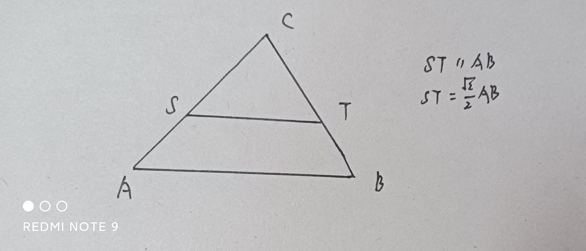
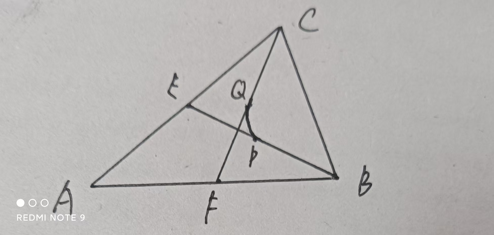
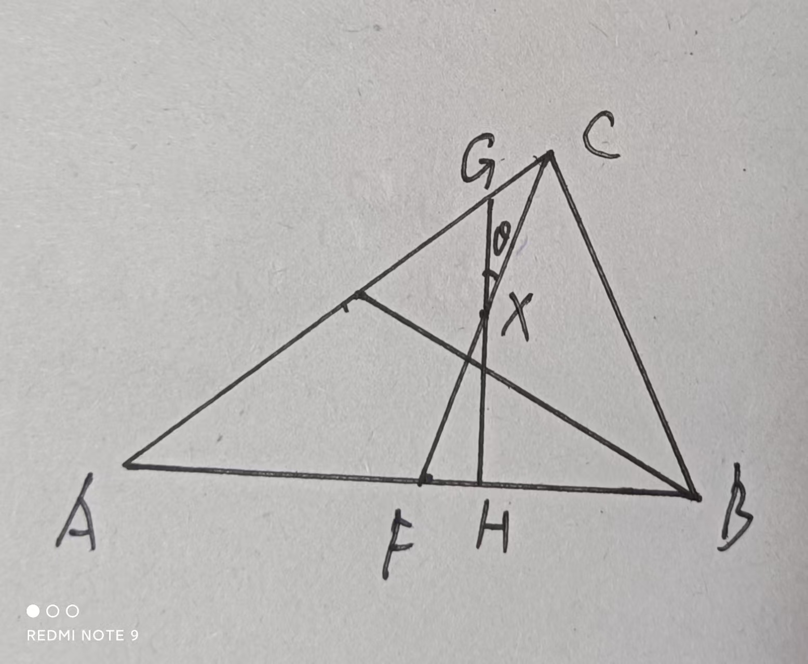

## 导入

小南梁卡洛特是古早动漫《幸运星》的大粉丝，她花钱买了里面陵樱学校的夏季款水手服，接着就发现钱包已然空空，连饭钱都要没了😥😥😥.于是，她只好用剩下的钱买了一块三明治，想着把它切成面积相等的两块，一块中午吃，一块晚上吃（同学们要节制消费，不要模仿哦）.

问题：请问卡洛特应该怎么切？能找到一个直线系[^1]囊括所有的切法吗？

[^1]: 一堆直线构成的集合.

## 先上解答

容易想到，卡洛特只要沿着一条中线切，或者根据三角形相似找出一条平行于一边的直线（条件如下图1所示）去切，就可以完成任务.

要找满足题意的所有直线，需要如下步骤:

1. 在 $\bigtriangleup ABC$ 中，作出三条中线，设为 $AD, BE, CF$.
2. 选取其中一角，这里选 $\angle A$，取**这个角的两边上的中线** $BE, CF$ 的中点分别为 $P, Q$.
3. 以 $AC, AB$ 所在直线为渐近线，作与 $CF, BE$ 切于 $P,Q$ 两点的**双曲线段**[^2].
4. 对 $\angle B, \angle C$ 重复操作2,3.
5. 能够平分 $\bigtriangleup ABC$ 面积的直线构成的直线系，就是上面作出来的三条双曲线段的所有切线的集合.

[^2]: 这里仿照直线和线段，用“双曲线段”表示双曲线上的一部分.

完成一条双曲线段的图大致如下（图2）.

## 关于双曲线是怎么来的

在初中的学习中，我们知道经反比例函数图象上的一点，作坐标轴的垂线，所围成的矩形面积一定.在高中，我们知道反比例函数的图象是双曲线，坐标轴就是它的两条渐近线，实际上，类似的与双曲线的渐近线有关的面积结论还有很多.在推导这个问题时，我们用到如下结论：

> 引理: 
> 
> 双曲线上任意一点的切线与它的渐近线围成的三角形面积为一个定值.

该定理的证明涉及复杂的字母运算，我们放到文章末尾.

三角形的中线平分三角形的面积，这是显而易见的.以上图为例，我们希望这条直线由 $BE$ 向 $CF$ “过渡”的过程中，不要改变 $\angle A$ 那部分三角形的面积.而根据上述定理，我们构造如上双曲线段，让这条直线作为该双曲线段的切线，就能保证这部分三角形是“双曲线上一点的切线与它的渐近线围成的三角形”，从而保证面积为定值，换个角也是同理的.

## 为何一定切于中线的中点

如下图3，我们用一种微元的思想来解释.

设上面第3步作出的双曲线（假装我们还不知道过哪个点）与 $CF$ 切于点 $X$ .

接着，作出该双曲线的另一条切线 $l$ ，这条切线与 $CF$ 的夹角很小，为 $\theta$ . $l$ 分别交 $AC, AB$ 于 $G,H$ .

由于偏转角度相当小，可以认为 $l$ 仍过点 $X$ .[^3]同时也可以认为 $XG=XC, XH=XF$ .

[^3]: 这步有点奇妙，希望有大佬解释一下.

由三角形面积不变，有

$$
S_{\bigtriangleup XCG}=\frac{1}{2} XC\cdot XG\sin{\theta}=\frac{1}{2} XC^{2}\sin{\theta}=S_{\bigtriangleup XFH}=\frac{1}{2} XF\cdot XH\sin{\theta}=\frac{1}{2} XF^{2}\sin{\theta}
$$

因此

$$
XC=XF
$$

$X$ 为 $CF$ 的中点，证毕！！！

## 引理的证明

考虑平面直角坐标系 $xOy$ 中的双曲线 $\frac{x^{2}}{a^{2}}-\frac{y^{2}}{b^{2}}=1$ ,作它在点 $P(x_0,y_0)$ 处的切线 $l$ ，分别交双曲线的渐近线 $m: y=\frac{b}{a} x$ 与 $n: y=-\frac{b}{a} x$ 于点 $A(x_1,y_1), B(x_2, y_2)$ .

由“代一半”法（证明略），得切线方程为：

$$
\frac{x_{0}x}{a^{2}}-\frac{y_{0}y}{b^{2}}=1
$$

接着，直接联立 $l$ 与 $m$， $l$ 与 $n$ 的方程，解得

$$
\begin{cases}
x_1=\frac{a^2 b}{bx_0-y_0}, \\
y_1=\frac{ab^2}{bx_0-y_0}, 
\end{cases}
$$

$$
\begin{cases}
x_2=\frac{a^2 b}{bx_0+y_0}, \\
y_2=-\frac{ab^2}{bx_0+y_0}.
\end{cases}
$$

因此

$$
\begin{aligned}
  |OA| |OB| &=\sqrt{x_1^2+y_1^2} \sqrt{x_2^2+y_2^2} \\
    &=\frac{a^4b^2+a^2b^4}{b^2x_0^2+a^2y_0^2}\\
    &=\frac{a^2+b^2}{\frac{x_0^{2}}{a^{2}}-\frac{y_0^{2}}{b^{2}}}
\end{aligned}
$$

根据 $P(x_0,y_0)$ 在双曲线上，有

$$
\frac{x_0^{2}}{a^{2}}-\frac{y_0^{2}}{b^{2}}=1
$$

因此

$$
\left | OA \right | \left | OB \right | = {a^2+b^2}
$$

渐近线与 $x$ 轴所成角满足

$$
\sin{\angle AOx}=\frac{a}{\sqrt{a^2+b^2} }, \cos{\angle AOx}=\frac{b}{\sqrt{a^2+b^2} }
$$

所以由对称性

$$
\begin{aligned}
  \sin{\angle AOB}&=\sin{2\angle AOx} \\
    &=2\sin{\angle AOx} \cdot \cos{\angle AOx} \\
    &=\frac {2ab}{a^2+b^2}
\end{aligned}
$$

因此

$$
S_{\triangle  AOB}=\frac{1}{2} \left | OA \right |  \left | OB \right | \sin{\angle AOB}=ab
$$

所以 $\triangle AOB$ 的面积为定值 $ab$ .证毕！！！！！！！！！！

更多疑问可致信河中数协官方邮箱<hyzxmath@outlook.com>或者在下方评论区留言，小南梁会耐心为您解答♡
