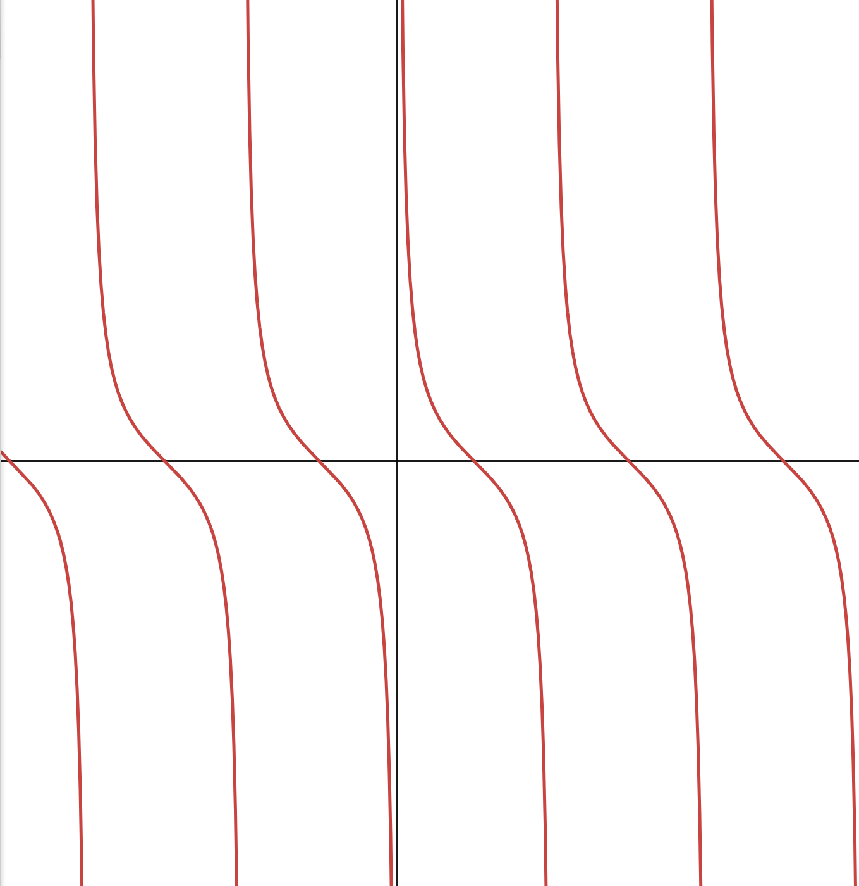
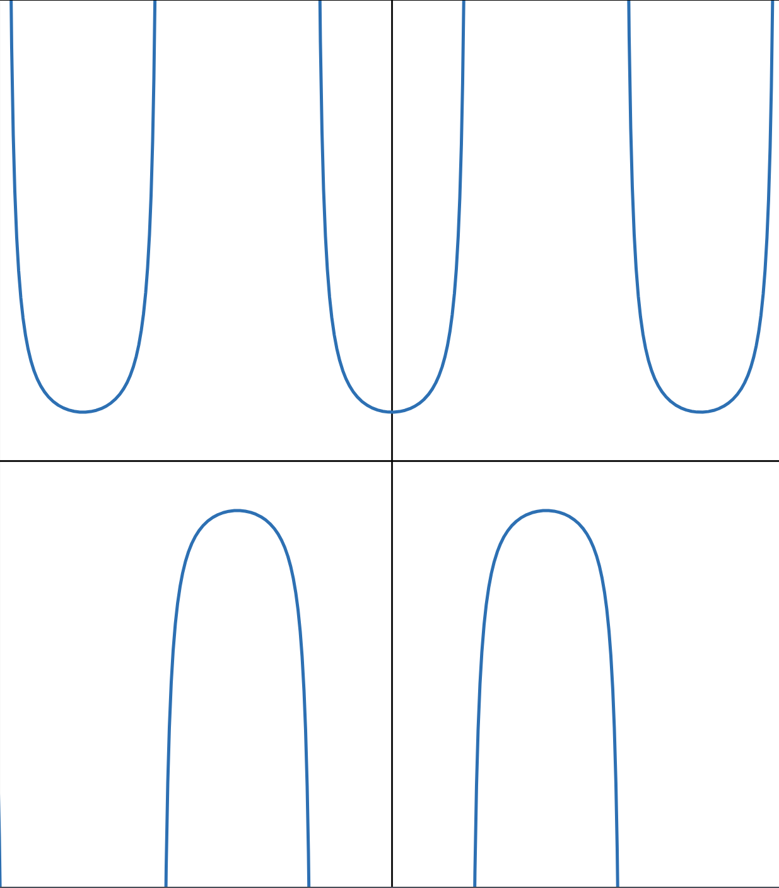
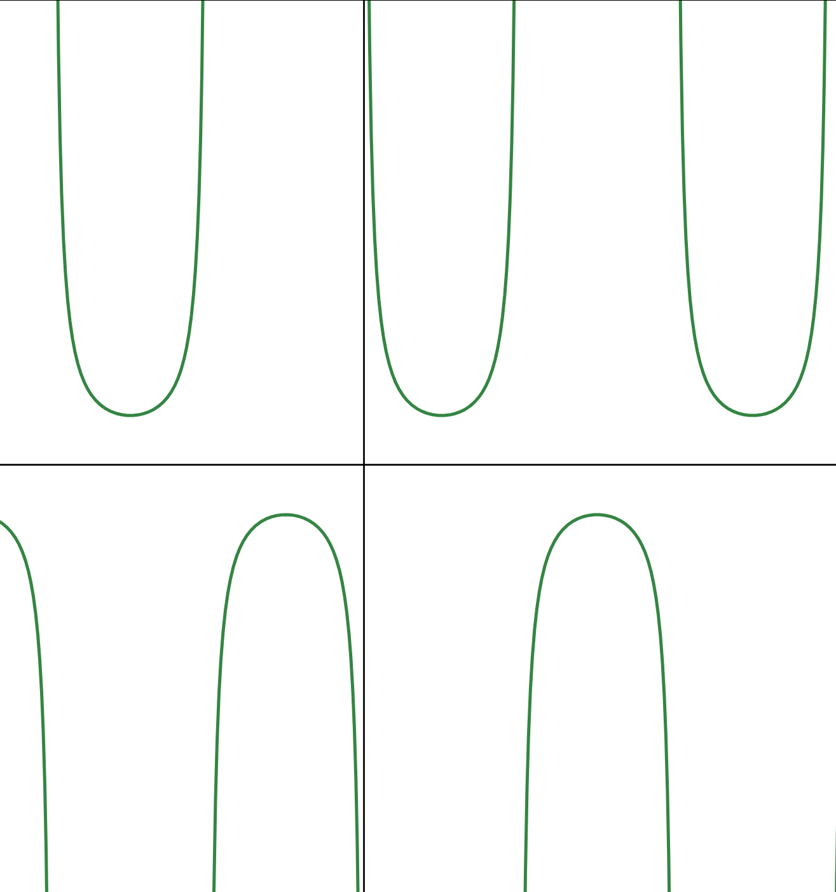
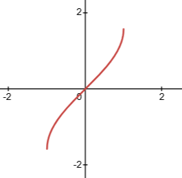
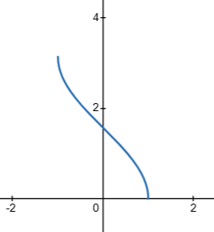
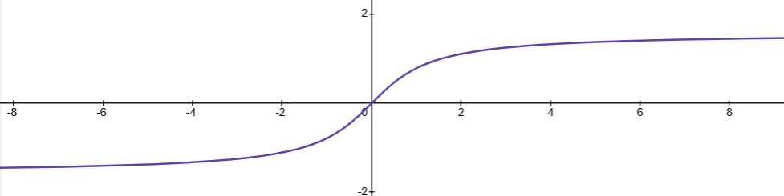

## 前言

反三角函数是三角函数的反函数, 是微积分学中不可避免要涉及到的一类基本初等函数, 但是高中教材中完全没有提及. 本文将课本没有的三角函数及其反函数的定义与性质进行总结, 以供同学们参考.

## 推荐视频

B 站[宋浩老师](https://space.bilibili.com/66607740)的课还是很不错的, 可以去看看



看完你就不需要继续看这篇文章咯

## 三角函数的扩充

在三角函数中, 最基本的一定是 $\sin x$ 和 $\cos x$. 课本已经给出了正弦、余弦和正切函数的详细定义与性质分析, 这里不再赘述. 下面我们讲一下这三个个三角函数:

1. 余切函数 $\cot x$
2. 正割函数 $\sec x$
3. 余割函数 $\csc x$

### 三角函数的定义

余切、正割和余割函数的定义如下:

$$
\begin{aligned}
\cot x &= \cfrac{1}{\tan x} = \cfrac{\cos x}{\sin x} \\
\sec x &= \cfrac{1}{\cos x} \\
\csc x &= \cfrac{1}{\sin x}
\end{aligned}
$$

根据这样的定义, 可以分析出不少的函数性质

### 三角函数的性质

#### 存在域和值域

由上面的定义可得下表

<!--markdownlint-disable MD060-->
|    函数    |                          存在域                           |                值域                 |
|:--------:|:------------------------------------------------------:|:---------------------------------:|
| $\cot x$ |       $\\{x \| x \neq k\pi, k \in \mathbb{Z}\\}$       |           $\mathbb{R}$            |
| $\sec x$ | $\\{x \| x \neq \frac{\pi}{2} k\pi, k \in \mathbb{Z}\\}$ | $(-\infty, -1] \cup [1, +\infty)$ |
| $\csc x$ |        $\\{x \| x \neq k\pi, k \in \mathbb{Z}\\}$        | $(-\infty, -1] \cup [1, +\infty)$ |

#### 周期性

直接瞪眼法 awa, 不难发现:

1. $\cot (x + \pi) = \cfrac{1}{\tan (x + \pi)} = \cfrac{1}{\tan x} = \cot x \Rightarrow \cot x$ 的基本周期为 $\pi$
2. $\sec (x + 2\pi) = \cfrac{1}{\cos (x + 2\pi)} = \cfrac{1}{\cos x} = \sec x \Rightarrow \sec x$ 的基本周期为 $2\pi$
3. $\csc (x + 2\pi) = \cfrac{1}{\sin (x + 2\pi)} = \cfrac{1}{\sin x} = \csc x \Rightarrow \csc x$ 的基本周期为 $2\pi$

#### 奇偶性

先给出一个定理:

> 对于任意的函数 $f(x)$, 它与 $\cfrac{1}{f(x)}$ 的奇偶性相同.

此定理是显然的.

由此我们就知道:

- $\cot x$ 为奇函数
- $\sec x$ 为偶函数
- $\csc x$ 为奇函数

#### 图像

都这样了咱就直接画图咯

#### 单调性

由上图, 显然:

1. $\cot x$ 在每个区间 $(k\pi, (k + 1)\pi), k \in \mathbb{Z}$ 上单调递减
2. $\sec x$ 在每个区间 $(2k\pi, (2k + 1)\pi), k \in \mathbb{Z}$ 上单调递增, 在每个区间 $((2k + 1)\pi, (2k + 2)\pi), k \in \mathbb{Z}$ 上单调递减
3. $\csc x$ 在每个区间 $(2k\pi, (2k + 1)\pi), k \in \mathbb{Z}$ 上单调递增, 在每个区间 $((2k + 1)\pi, (2k + 2)\pi), k \in \mathbb{Z}$ 上单调递减

### 诱导公式

$2\pi$:

1. $\cot (2\pi + x) = \cot x$
2. $\sec (2\pi + x) = \sec x$
3. $\csc (2\pi + x) = \csc x$
4. $\cot (2\pi - x) = - \cot x$
5. $\sec (2\pi - x) = \sec x$
6. $\csc (2\pi - x) = - \csc x$

$\pi$:

1. $\cot (\pi + x) = \cot x$
2. $\sec (\pi + x) = - \sec x$
3. $\csc (\pi + x) = - \csc x$
4. $\cot (\pi - x) = - \cot x$
5. $\sec (\pi - x) = - \sec x$
6. $\csc (\pi - x) = \csc x$

$\frac{\pi}{2}$:

1. $\cot \left(\frac{\pi}{2} + x\right) = - \tan x$
2. $\sec \left(\frac{\pi}{2} + x\right) = - \csc x$
3. $\csc \left(\frac{\pi}{2} + x\right) = \sec x$
4. $\cot \left(\frac{\pi}{2} - x\right) = \tan x$
5. $\sec \left(\frac{\pi}{2} - x\right) = \csc x$
6. $\csc \left(\frac{\pi}{2} - x\right) = \sec x$

### 三角函数的导数

性质讲的差不多了那我们就上导数吧 awa

1. $(\tan x)' = \left(\cfrac{\sin x}{\cos x}\right)' = \cfrac{\cos^2 x + \sin^2 x}{\cos^2 x} = \sec^2 x$
2. $(\cot x)' = \left(\cfrac{1}{\tan x}\right)' = - \cfrac{\sec^2 x}{\tan^2 x} = -\csc^2 x$
3. $(\sec x)' = \left(\cfrac{1}{\cos x}\right)' = \cfrac{\sin x}{\cos^2 x} = \sec x \tan x$
4. $(\csc x)' = \left(\cfrac{1}{\sin x}\right)' = - \cfrac{\cos x}{\sin^2 x} = - \csc x \cot x$

$\uarr \uarr \uarr$ 上面的导数公式给我背熟！！！ $\uarr \uarr \uarr$

## 反三角函数

嗯~ o(*￣▽￣*)o
三角函数搞完了就可以看反三角函数啦awa

### 反三角函数的定义

三角函数是由角求比值, 反三角函数就是由比值求角.
但是, 由于三角函数的周期性, 使得 6 个三角函数在 $\mathbb{R}$ 上都不是单射, 所以都没有反函数.
这样子, 我们就必须对定义域进行限制, 保证反函数的存在性.

怎么限制呢？不妨直接选一个周期或半个周期长的区间, 在保证值域和定义域为 $\mathbb{R}$ 的值域相同的基础上, 尽量靠近原点, 那我们就只需要考虑下面的函数:

1. $y = \sin x, x \in \left[-\frac{\pi}{2}, \frac{\pi}{2}\right], y \in [-1, 1]$
2. $y = \cos x, x \in [0, \pi], y \in [-1, 1]$
3. $y = \tan x, x \in \left(-\frac{\pi}{2}, \frac{\pi}{2}\right), y \in \mathbb{R}$

于是我们就可以定义反正弦、反余弦和反正切函数

- $y = \arcsin x, x \in [-1, 1], y \in [-\frac{\pi}{2}, \frac{\pi}{2}]$
- $y = \arccos x, x \in [-1, 1], y \in [0, \pi]$
- $y = \arctan x, x \in \mathbb{R}, y \in [-\frac{\pi}{2}, \frac{\pi}{2}]$

### 反三角函数的图像和性质

  

#### 单调性

- $\arcsin x, \arctan x$ 在其定义域内单调递增
- $\arccos x$ 在定义域内单调递减

#### 奇偶性

- $\arcsin x, \arctan x$ 都为奇函数
- $\arccos x$ 既不是奇函数也不是偶函数

到这里其实反三角函数就了解的差不多咯~  
我们还是推荐看B 站[宋浩老师](https://space.bilibili.com/66607740)的视频awa
