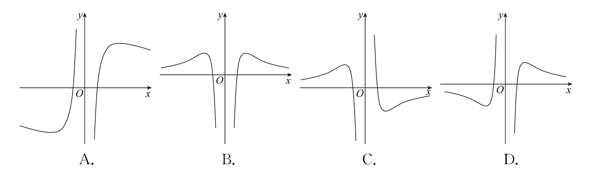
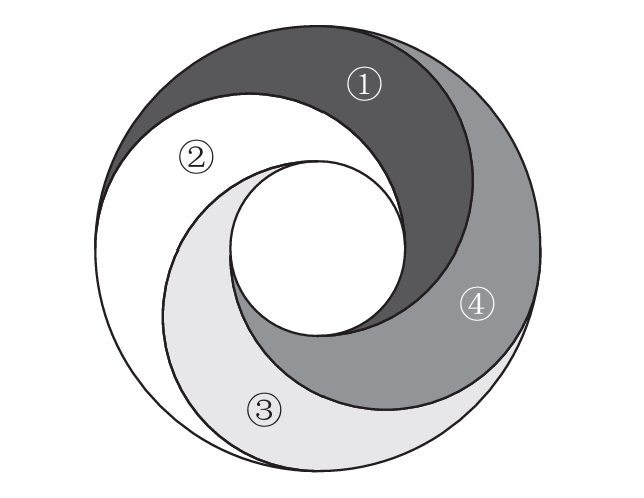

[源文件](paper.pdf)

<!--markdownlint-disable MD029-->

## 注意事项

> 本试卷共 4 页,  19 题. 全卷满分 150 分. 考试用时 120 分钟.
>
> **注意事项**：
>
> 1. 答题前, 先将自己的姓名、准考证号填写在答题卡上, 并将准考证号条形码粘贴在答题卡上的指定位置.
> 2. 选择题的作答：每小题选出答案后, 用 2 B 铅笔把答题卡上对应题目的答案标号涂黑. 写在试题卷、草稿纸和答题卡上的非答题区域均无效.
> 3. 非选择题的作答：用签字笔直接写在答题卡上对应的答题区域内. 写在试题卷、草稿纸和答题卡上的非答题区域均无效.
> 4. 考试结束后, 请将本试题卷和答题卡一并上交.

## 一、选择题

> 本题共 8 小题, 每小题 5 分, 共 40 分. 在每小题给出的四个选项中, 只有一项是符合题目要求的.

1. $\dfrac{\mathrm{A}^2_{2026}}{\mathrm{C}^2_{2026}}=$
    - A. $\frac{1}{2}$
    - B. $2$
    - C. $\frac{1}{2026}$
    - D. $2026$
2. 曲线  $f(x)=\sqrt{\mathrm{e}^{x}}$  在点  $(0, f(0)) $ 处的切线方程为
    - A. $x+2 y+2=0$
    - B. $x+2 y-2=0$
    - C. $x-2 y+2=0$
    - D. $x-2 y-2=0$
3. 设  $f^{\prime}(x)$  是 $ f(x)  $的导函数, 已知  $f(x)=3 f^{\prime}(1) x-2 \ln x$  , 则  $f^{\prime}(1)=$
    - A. 1
    - B. -1
    - C. 2
    - D. -2
4. 甲计划按照一定的先后顺序写一篇介绍 8 个文化地标的文章, 若第一个介绍的是地标  $A$  , 且地标  $B, C, D$  的介绍顺序必须相邻（中间不能插入其他地标, 内部顺序可自由调整）, 则该文章关于这 8 个文化地标的介绍顺序共有
    - A. 360 种
    - B. 720 种
    - C. 1440 种
    - D. 2160 种
5. 学校图书馆有 4 个不同的借阅窗口（编号为  $1,2,3,4$）, 现将 3 本完全相同的图书放到这 4 个窗口展示, 每个窗口可放多本也可不放, 则不同的摆放方法共有
    - A. 12 种
    - B. 16 种
    - C. 20 种
    - D. 24 种
6. 函数 $ f(x)=\frac{10 |x| \ln |x| }{x^{3}}$  的大致图象为

7. 已知三次函数  $f(x)=x^{3}-4 x^{2}+4 x$  ，若不等式 $ f(x) \leqslant m $ 的解集为  $\{x \mid x \leqslant m\} $ ，则实数  m  的值为
    - A. 3
    - B. 2
    - C. 1
    - D. 0
8. 设 $ a=\mathrm{e}^{\frac{1}{2026}}, b=\frac{2027}{2026}, c=\mathrm{e}^{\frac{1}{2027}}$  ，则
    - A. $a>c>b$
    - B. $b>c>a$
    - C. $c>a>b$
    - D. $a>b>c$

## 二、选择题

> 本题共 3 小题，每小题 6 分，共 18 分。在每小题给出的选项中，有多项符合题目要求。全部选对的得 6 分，部分选对的得部分分，有选错的得 0 分。

9. 已知  $m, n $ 均为正整数，且 $ m<n $ ，则
    - A. $\mathrm{C}^5_{11} = \mathrm{C}^6_{11}$
    - B. $\mathrm{A}^{m}_n = \mathrm{A}^{n-m}_n$
    - C. $\mathrm{A}^{m-1}_n = \mathrm{C}^{m-1}_n \mathrm{A}^{m-1}\_{m-1} (m>1)$
    - D. $\frac{1}{n-m} \mathrm{A}^{m+1}_{n} = \mathrm{A}\_{n}^{m}$
10. 甲、乙、丙、丁四名同学报名参加假期社区服务活动，社区服务活动共有＂关怀老人＂、＂环境检测＂、＂图书义卖＂这三个项目，每人都要报名且限报其中一项，则下列说法正确的是
    - A. 四名同学的报名情况共有  $3^{4}$  种
    - B. 每个项目都有人报名的情况共有 $36$ 种
    - C. 四名同学最终只报名了两个项目的情况共有 $42$ 种
    - D. 恰有两名同学所报项目相同且只有甲同学一人报名＂关怀老人＂的情况共有 $12$ 种
11. 已知函数 $ f(x)=\dfrac{\sin x}{3+\cos x}$  ，则
    - A. $f(x) $ 为奇函数
    - B. $f(\pi+x)=f(x)$
    - C. $f(\pi-x)=-f(x)$
    - D. f(x)  在 $ \left[0, \dfrac{\pi}{2}\right] $ 上单调递增

## 三、填空题

> 本题共 3 小题，每小题 5 分，共 15 分。

12. 若函数  $f(x)=(x-1)(x-2)(x-3)$  ，则 $ f^{\prime}(3)=$ _______。
13. 已知某六名同学在 CMO 竞赛中获得前六名（无并列情况），其中甲或乙是第一名，丙不是前三名，则这六名同学的名次情况共有 _______ 种.
14. 某 Livehouse 舞台的环形氛围灯被设计为如图所示的 4 个环形相邻灯区. 现有 5 种䨘虹灯光色可供选择，要求每个灯区只使用一种颜色，且相邻灯区颜色不相同，则该舞台灯区共有 _______ 种不同的颜色搭配方案。

## 四、解答题

> 本题共 5 小题，共 77 分，解答应写出必要的文字说明，证明过程和演算步骤。

15. （本小题满分 13 分）
现有4名男生、3名女生站成一排拍照留念，在下列不同条件下，求不同的站法总数。（结果用数字表示）
    - （1）女生互不相邻；
    - （2）若甲、乙是这7人中的2人，甲不站在排头，乙不站在排尾。
16. （本小题满分 15 分）
已知函数  $f(x)=\dfrac{x^{3}+x+2}{x}$  .
    - （1）判断  $f(x)$  的单调性；
    - （2）若关于  $x$  的方程  $f(x)=m $ 只有 1 个实数解，求实数 $ m$  的取值范围.
17. （本小题满分 15 分）
某高校新媒体社团有 7 位同学，他们计划对短视频剪辑、直播运营、图文排版、创意脚本撰写这 4 个当下热门的新媒体项目展开学习调研，要求每个项目至少有一人负责，且每人只能选择一个项目。
    - （1）若从社团中选出 4 人去调研，共有多少种不同的调研安排方案？
    - （2）若 7 位同学同时参与调研，其中的甲、乙、丙 3 位同学调研同一项目，共有多少种不同的安排方案？
18. （本小题满分 17 分）
已知函数  $f(x)=a x-3+\dfrac{1}{x+1}(a \in \mathbb{R})$.
    - （1）当  $a=1$  时，求  f(x)  的极值；
    - （2）若  $3 x-2 \geqslant f(x)  $ 对  $\forall x \in[0,+\infty) $ 恒成立，求  $a$  的取值范围；
    - （3）若 $  a=3  $，证明：当 $ 0 \leqslant x<\dfrac{\pi}{2}$  时， $ \tan x>f(x)$.
19. （本小题满分 17 分）
已知函数 $ f(x)=a x^{3}+2 x^{2}+2 x(a \in \mathbb{R}) $ ，且 $ x=1$  为 $ f(x)$  的极值点.
    - （1）求  $a$  的值；
    - （2）过原点  $(0,0) $ 作曲线 $ y=f(x) $ 的切线，求切线方程；
    - （3）过点  $(0, m)(m \in \mathbb{R})$  作曲线 $ y=f(x) $ 的切线，讨论切线的条数.
